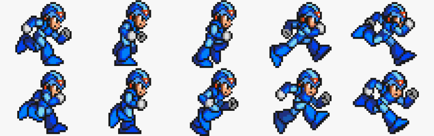
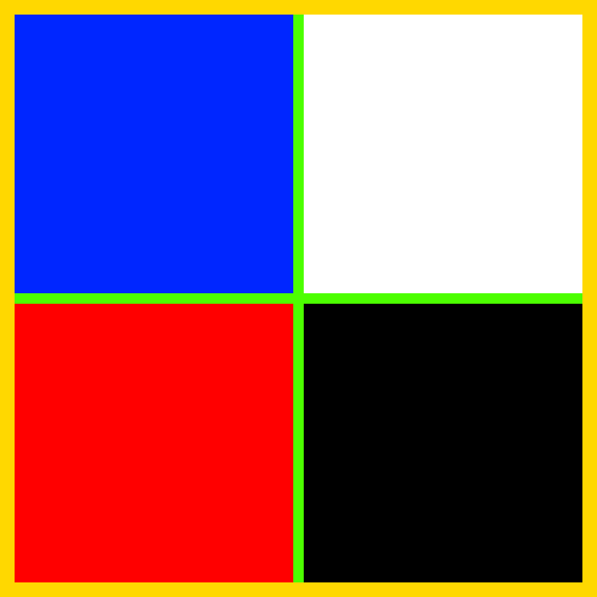

# @rbxts/react-motion

A port of `@rbxts/motion` to React.

- [Introduction](#introduction)
- [The `motion` object](#the-motion-object)
- [Transitions](#transitions)
- [The `initial` prop](#the-initial-prop)
- [Variants](#variants)
- [Sprite animations](#sprite-animations)
- [Copy & paste example using `motion` object](#copy--paste-example-using-motion-object-works-with-hoarcekat)
- [useTween](#usetween)
- [Copy & paste example using `useTween`](#copy--paste-example-using-useTween-works-with-hoarcekat)

## Introduction

Simply animate UI from point A to B with Motion, a simple yet powerful animation library for roblox-ts & React, inspired by Framer motion.

## The `motion` object

The core of Motion is the `motion` object. Think of it as a plain Roblox GUI element, supercharged with animation capabilities:

```ts
import motion from "@rbxts/react-motion";
```

Animating a Motion component is as straight-forward as setting the `animate` prop:

```tsx
<motion.textbutton animate={{ TextSize: 24 }} />
```

When the `animate` prop changes, Motion will automatically generate an animation to the latest value. This animation will feel great by default, but it can be configured with the flexible `transition` prop.

## Transitions

A transition defines how values animate from one state to another. If you've ever used tweens in Roblox before, then it's very similar to using `TweenInfo`:

```tsx
const [size, setSize] = useState(UDim2.fromOffset(200, 50));

return (
  <motion.textbutton
    animate={{ Size: size }}
    Event={{
      Activated: () => setSize(size => UDim2.fromOffset(size.X.Offset + 50, size.Y.Offset + 50)),
    }}
    Size={UDim2.fromOffset(200, 50)}
    Text="Increase the size of this button!"
    transition={{
      // each of these are also their respective defaults
      duration: 1,
      ease: "linear",
      repeat: 0, // -1 for infinity
      reverse: false,
      delay: 0,
    }}  
  />
);
```

Additionally, Motion allows you to pass cubic Bézier easing functions, [similarly to how you would in CSS](https://developer.mozilla.org/en-US/docs/Web/CSS/easing-function#cubic-bezier-easing-function):

```tsx
const [size, setSize] = useState(UDim2.fromOffset(200, 50));

return (
  <motion.textbutton
    animate={{ Size: size }}
    Event={{
      Activated: () => setSize(size => UDim2.fromOffset(size.X.Offset + 50, size.Y.Offset + 50)),
    }}
    Size={UDim2.fromOffset(200, 50)}
    Text="Increase the size of this button!"
    transition={{
      duration: 1,
      ease: [0.25, 0.1, 0.25, 1], // equivalent to `ease` in CSS
    }}  
  />
);
```

You're also free to just write the easings built-in to the web...

```
transition={{
  ease: "ease", // or "easeIn", "easeInOut" and "linear"
}}
```

...or those found on [easings.net](https://easings.net/).

```
transition={{
  ease: "easeOutQuint",
}}
```

>[!NOTE]
>Since all easings from easings.net (along with `linear`) are built into tweens on Roblox natively, Motion will automatically resort to using a native Roblox tween for performance and stability. You can still use custom Bézier tweens, of course, but keep in mind they may act unexpectedly or with suboptimal performance.

## The `initial` prop

The `initial` prop defines the properties for a Motion component to be set at the beginning. It differs from just setting props normally, as you can reference variants (more on those later) and state without it changing:

```tsx
const [size, setSize] = useState(UDim2.fromOffset(200, 50));

return (
  <motion.textbutton
    animate={{ Size: size }}
    initial={{ Size: size }}
    Event={{
      Activated: () => setSize(size => UDim2.fromOffset(size.X.Offset + 50, size.Y.Offset + 50)),
    }}
    Text="Increase the size of this button!"
  />
);
```

This will work exactly the same as the example above, however now you can reference the initial `size` directly without it rerendering each time.

As a shortened version, if your  `animate` and `initial` props are the same, you can just pass `false`:

```tsx
const [size, setSize] = useState(UDim2.fromOffset(200, 50));

return (
  <motion.textbutton
    animate={{ Size: size }}
    initial={false}
    Event={{
      Activated: () => setSize(size => UDim2.fromOffset(size.X.Offset + 50, size.Y.Offset + 50)),
    }}
    Text="Increase the size of this button!"
  />
);
```

## Variants

Variants are a bit like classes in CSS in that you can define props specific to each variant. They're applied based on the `animate` and `initial` props:

```tsx
const [state, setState] = useState<"hover" | "default">("default");

return (
  <motion.textbutton
    animate={state}
    initial="default"
    Event={{
      MouseEnter: () => setState("hover"),
      MouseLeave: () => setState("default"),
    }}
    Size={UDim2.fromOffset(200, 50)}
    variants={{
      hover: {
        TextColor3: new Color3(0, 1, 0),
      },
      default: {
        TextColor3: new Color3(1, 1, 1),
      },
    }}
  />
);
```

Transitions can also be used in variants. If used in both variants and as a prop simultaneously, the transitions will be merged into one transition. In the case of a conflict between a variant transition and the `transition` prop, the variant transition will have priority over the `transition` prop and will override it. In other words, they *cascade*.

>[!WARNING]
>This differs from the behaviour of `@rbxts/motion`, which instead prioritises the `transition` prop over variants' transition. If you're migrating from `@rbxts/motion`, make sure you account for this.

```tsx
const [state, setState] = useState<"hover" | "default">("default")

const buttonVariants = {
  hover: {
    TextColor3: new Color3(0, 1, 0),
    transition={{ 
      duration: 20,
      ease: "easeOutElastic", // overrides `easeInOutQuint`
      reverses: true, // unique to the `hover` variant
    }}
  },
  default: {
    TextColor3: new Color3(1, 1, 1),
    transition={{ 
      duration: 1, // overrides 20
      ease: "easeInQuad", // overrides `easeInOutQuint`
      repeat: 2, // unique to the `default` variant
    }}
  },
};

return (
  <motion.textbutton
    animate={state}
    transition={{
      duration: 20,
      ease: "easeInOutQuint",
      delay: 0.5, // gets added to all variants
    }}
    Event={{
      MouseEnter: () => setState("hover"),
      MouseLeave: () => setState("default"),
    }}
    variants={buttonVariants}
  />
);
```

Earlier, I mentioned variants were like CSS classes. This is also true in that you can specify multiple variants by passing them in using an array. If a conflict between variants emerges, then the variant specified later in the array (i.e. the one with a higher index) will override any variants before it.

This is useful for components which have multiple pieces of state that each need their own styles to animate to, like a button which can be selected:

```tsx
function SelectButton() {
  const [state, setState] = useState<"hover" | "default">("default");
  const [selected, setSelected] = useState(false);
  const selectionStatus = useMemo(() => selected ? "selected" : "unselected", [selected]);

  return (
    <motion.textbutton
      animate={[state, selectionStatus]}
      Event={{
        Activated: () => setSelected((selected) => !selected),
        MouseEnter: () => setState("hover"),
        MouseLeave: () => setState("default"),
      }}
      variants={{ 
        hover: {
          // props here
        },
        default: {
          // props here
        },
        selected: {
          // props here, will override `hover` and `default`
        },
        unselected: {
          // props here, will override `hover` and `default`
        },
      }}
    />
  );
}
```

You could even go further and have components which accept passing down `animate` props and automatically merging them, like a `Button` which implemented the hovering animation and a `SelectButton` that implemented the `selected`-`unselected` variants and passed those down to `Button`.

## Sprite animations

Sprite animations are similar to (very short and small) videos in that they use rapidly changing frames to simulate a playing video, using a spritesheet. A spritesheet is an image which contains many sprites (which, in the case of sprite animation, act as our frames) in a regular sequence, for example this Mega Man spritesheet: 

Motion provides you with a hook that can automatically play a sprite animation on an image:

```tsx
const { rectOffset, rectSize } = useSpritesheet({
  fps: 23,
  imageResolution: new Vector2(860, 270),
  mode: "loop",
  sprites: 10,
  spritesPerLine: 5,
});

return (
  <imagelabel
    BackgroundTransparency={1}
    Image="http://www.roblox.com/asset/?id=133583776880203"
    ImageRectOffset={rectOffset}
    ImageRectSize={rectSize}
    Size={UDim2.fromOffset(50, 50)}
  />
);
```

The `mode` argument can be any of `loop`, `playOnce` and `static`:

| Mode | Description |
| --- | --- |
| static | Remains on one frame and doesn't change unless frame is manually set using `setFrame`. |
| playOnce | Plays the sprite animation, doesn't replay after the first iteration. |
| loop | Plays the sprite animation, replays after each iteration. |

Using this, you can also pause and play sprite animations:

```tsx
const [mode, setMode] = useState<"loop" | "playOnce" | "static">("static");
const { rectOffset, rectSize } = useSpritesheet({
  // `imageResolution`, `sprites` and `spritesPerAxis` defined somewhere already
  mode,
});

return (
  <frame>
    <imagelabel
      Image="ASSET_ID_HERE"
      ImageRectOffset={rectOffset}
      ImageRectSize={rectSize}
      Size={UDim2.fromOffset(100, 100)}
    />
    <textbutton
      Event={{
        Activated: () => setMode(mode === "static" ? "loop" : "static")
      }}
      Size={UDim2.fromOffset(100, 100)}
      Text={mode === "static" ? "Play" : "Pause"}
    />
    <uilistlayout />
  </frame>
);
```

See below for a full reference of arguments...

| Argument | Type | Description |
| --- | --- | --- |
| active | `boolean`, optional, default: `true` | Whether the spritesheet is running. This differs from simply setting `mode` to `static` in that, when `active` is `false`, the hook will return to the default `rectOffset` and `rectSize` and will not manipulate the image in any way; you can think of this as a killswitch for the sprite animation. |
| fps | `number`, optional, default: `15` | The speed at which your sprite animation is played. |
| imageResolution | `Vector2`, required | The width and height of your decal. Images beyond 1024x1024 are downscaled; download your asset from the Roblox site to check for the true resolution. |
| mode | `"static" \| "playOnce" \| "loop"`, optional, default: `"loop"` | The way in which Motion displays your sprite. |
| range | `[number, number]`, optional | The range of sprites Motion will play through; 0-indexed and inclusive. |
| sprites | `number`, required | The total number of sprites in your spritesheet. |
| spritesPerLine | `number`, required | The number of sprites in one line. If `vertical` is `true`, then a line is a column in your spritesheet, otherwise it's a row. |
| vertical | `boolean`, optional, default: `false` | Whether your sprites are laid out top-to-bottom. |

...and below for a full reference of return values.

| Return value | Type | Description |
| --- | --- | --- |
| frame | `number` | The current frame the sprite animation is on. This is just regular React state as returned from `useState`, so it can be passed as a dependency in `useEffect`, `useMemo` etc. |
| rectOffset | `Vector2` | The current frame translated into an `ImageRectOffset`. You should pass this value as the `ImageRectOffset` prop in your `ImageButton` or your `ImageLabel`.
| rectSize | `Vector2` | The calculated `ImageRectSize` based on `imageResolution`, `sprites`, `spritesPerLine` and `vertical`. You should pass this value as the `ImageRectSize` prop in your `ImageButton` or your `ImageLabel`. |
| setFrame | `(frame: number) => void` | The setter for `frame`. This is also just the setter passed from `useState`, and you can use this function to manually set the current frame. |

### Sprite animations using Motion components

TODO

### Limitations

Motion's implementation of sprite animations does come with downsides, particularly against [SpriteClip](https://devforum.roblox.com/t/spriteclip-sprite-sheet-animation-module/294195?u=onerake), another module which implements sprite animations in Roblox.

In particular, SpriteClip allows you to set offsets between sprites and the border of the image itself, while Motion currently requires there to be no padding or spacing between sprites or the edge of the spritesheet. Say this is your spritesheet: 

Here, the yellow represents the border of the image, the green represents the offsets between each of the sprites, and the sprites themselves are blue, white, red and black.

A spritesheet similar to this one would not be supported by Motion. If you have a spritesheet with spacing/padding between sprites and the spritesheet's border and you have no way of eliminating these, then consider using something like SpriteClip instead. You can find a roblox-ts compatible package [here](https://github.com/Firere/SpriteClip).

## Copy & paste example using `motion` object (works with Hoarcekat)

```tsx
import React, { useState } from "@rbxts/react";
import { createPortal, createRoot } from "@rbxts/react-roblox";
import motion from "@rbxts/react-motion";

const variants = {
  off: {
    BackgroundColor3: new Color3(1, 1, 1),
    Size: UDim2.fromOffset(300, 100),
    TextColor3: new Color3(0, 0, 0),
  },
  on: {
    BackgroundColor3: new Color3(0, 0, 0),
    Size: UDim2.fromOffset(300, 90),
    TextColor3: new Color3(1, 1, 1),
  }
};

function Button() {
  const [state, setState] = useState<"on" | "off">("off");

  return (
    <motion.textbutton
      animate={state}
      AnchorPoint={new Vector2(0.5, 0.5)}
      Event={{
        MouseEnter: () => setState("on"),
        MouseLeave: () => setState("off"),
      }}
      Position={UDim2.fromScale(0.5, 0.5)}
      Size={UDim2.fromOffset(300, 100)}
      Text="Hello"
      TextSize={20}
      transition={{
        duration: 0.3,
      }}
      variants={variants}
    >
      <motion.uicorner
        animate={{
          CornerRadius: new UDim(0, state === "on" ? 20 : 0),
        }}
        transition={{
          duration: 0.3,
        }}
      />
    </motion.textbutton>
  );
}

export = (target: Instance) => {
  const root = createRoot(new Instance("Folder"));
  root.render(createPortal(<Button />, target));

  return () => root.unmount();
}
```

## useTween

That's not all Motion has to offer, though! If you'd like, you can use the `useTween` hook provided by motion. This allows you to animate any component in your codebase without having to use `motion` or the `animate` prop, as it returns a setter for the variant:

```tsx
const ref = useRef<Frame>();
const [variant, setVariant] = useTween(ref, {
  initial: "default",
  transition: {
    duration: 3,
    ease: "easeInOutQuad",
  },
  variants: {
    hover: {
      BackgroundColor3: new Color3(0, 1, 0),
      transition: {
        duration: 0.5,
      },
    },
    default: {
      BackgroundColor3: new Color3(1, 0, 0),
      transition: {
        duration: 3,
      },
    },
  },
});

useEffect(() => print("Variant changed:", variant), [variant]);

return (
  <frame
    BackgroundColor3={new Color3(1, 0, 0)}
    Event={{ 
      MouseEnter: () => setVariant("hover"),
      MouseLeave: () => setVariant("default"),
    }}
    ref={ref}
  />
);
```

<<<<<<< Updated upstream
Because `useTween` simply takes in a ref, you can animate any React component with Motion, even if the `motion` object doesn't have it! If you still want to use the same syntax as you would with the `motion` object but with a different element, Motion also exports `createMotionComponent`:

```tsx
import { createMotionComponent } from "@rbxts/react-motion";

const Part = createMotionComponent("Part");
=======
Because `useTween` simply takes in a ref, you can animate any React component with Motion, even if `Motion` doesn't have it! If you still want to use the same syntax as you would with `Motion` but with a different element, Motion also exports `createComponent`:

```tsx
const Part = motion.createComponent("Part");
>>>>>>> Stashed changes
const part = <Part animate={} initial={} transition={} variants={} />
```

## Copy & paste example using `useTween` (works with Hoarcekat)

```tsx
import React, { useRef } from "@rbxts/react";
import { createPortal, createRoot } from "@rbxts/react-roblox";
import { useTween } from "@rbxts/react-motion";

const variants = {
  off: {
    BackgroundColor3: new Color3(1, 1, 1),
    Size: UDim2.fromOffset(300, 100),
    TextColor3: new Color3(0, 0, 0),
  },
  on: {
    BackgroundColor3: new Color3(0, 0, 0),
    Size: UDim2.fromOffset(300, 90),
    TextColor3: new Color3(1, 1, 1),
  }
};

function Button() {
  const button = useRef<TextButton>();
  const [variant, setVariant] = useTween(button, {
    variants,
    transition: {
      duration: 0.3
    }
  });

  const uiCorner = useRef<UICorner>();
  useTween(uiCorner, {
    animate: {
      CornerRadius: new UDim(0, variant === "on" ? 20 : 0),
    },
    transition: {
      duration: 0.3,
    },
  });

  return (
    <textbutton
      AnchorPoint={new Vector2(0.5, 0.5)}
      BackgroundColor3={new Color3(1, 1, 1)}
      Event={{
        MouseEnter: () => setVariant("on"),
        MouseLeave: () => setVariant("off"),
      }}
      Position={UDim2.fromScale(0.5, 0.5)}
      ref={button}
      Size={UDim2.fromOffset(300, 100)}
      Text="Hello"
      TextColor3={new Color3(0, 0, 0)}
      TextSize={20}
    >
      <uicorner ref={uiCorner} />
    </textbutton>
  );
}

export = (target: Instance) => {
  const root = createRoot(new Instance("Folder"));
  root.render(createPortal(<Button />, target));

  return () => root.unmount();
}
```